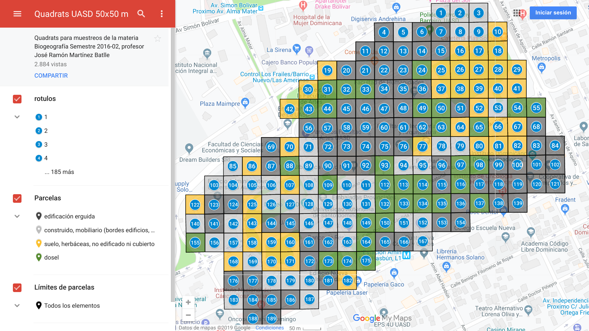

```{r setup, include=FALSE}
knitr::opts_chunk$set(echo = TRUE)
str_break = function(x, width = 80L) {
  n = nchar(x)
  if (n <= width) return(x)
  n1 = seq(1L, n, by = width)
  n2 = seq(width, n, by = width)
  if (n %% width != 0) n2 = c(n2, n)
  substring(x, n1, n2)
}
```

# Guía de referencia para la práctica de campo

>Los viajes de campo nos ayudan a ratificar que sabemos poco o nada acerca de la naturaleza

No deberían existir obstáculos para salir al campo porque, a fin de cuentas, es allí donde podemos recoger datos y donde nos surgirán nuevas preguntas. Normalmente, durante una fase de exploración, los planes son inútiles, incluso molestos. Pero cuando se trata de responder preguntas concretas, entonces hay que añadir una capa de planificación, que incluya preguntas de investigación y diseño de muestreo, preferiblemente con un enfoque de reproducibilidad (ejem, luego los administrativos te dirán que es más importante hacer 20 solicitudes de cheques, escribir 30 oficios y 10 informes, buscar 50 cotizaciones y cualquier otra vaina con tal de que no viajes; corre por tu vida en el momento que veas más papeles que datos). Este repo aspira a cumplir dicha misión de asesorarte con un mínimo de planificación en tu recogida de datos, reconociendo en todo caso que se trata de un "trabajo en desarrollo".

## Enfoques

Basado en las preguntas de cada estudiante, se puede asumir que hay al menos dos enfoques en los estudios sobre hormigas a realizar:

### Relación con el hábitat


### Nidos


### ¿Acaso hay un tercer enfoque relacionado con cebos?

Parecería que surje un tercero, que es el tema del efecto que pueden tener los cebos en las muestras. Sin embargo, no encontré mucha "fuerza" en las preguntas formuladas sobre este tema, y pienso que se pueden agrupar en el enfoque "relación con el hábitat".

Utiliza las siguientes listas de control en forma de tareas, para confirmar que dispones de lo necesario para iniciar la colecta de especímenes/datos.

## Parcelas asignadas

Las parcelas asignadas a cada persona las obtuve ejecutando el código que verás a continuación.

Primero creé una función para asignar las parcelas, que puedes consultar en el siguiente *script*. La asignación se realiza siguiendo un muestreo estratificado-aleatorio.
```{r}
source('parcelalea.R')
```

A continuación cargué el archivo de parcelas 50x50 del campus UASD, definí tipos de cobertura por persona y le pedí a la función `parcelalea` que seleccionara, aleatoriamente, un número de parcelas dentro de los tipos de coberturas asignadas a cada persona:

```{r, warning=F, message=F}
library(sf)
library(tidyverse)
library(kableExtra)
parcelas_uasd <- st_read('c50mpctgrp_para_googlemaps.gpkg')
```


>[Aquí](https://drive.google.com/open?id=171pW12jdkDwmzJuwjocoVjnC7ns&usp=sharing) alojé el mapa estilizado que ves arriba, el cual puedes consultar desde cualquier PC con conexión a Internet y también usarlo en el campo con el teléfono. Puedes descargarlo desde GoogleMaps para trabajar en el campo sin conexión a Internet.

Estos son los tipos de coberturas del campus

```{r, warning=F, message=F}
unique(parcelas_uasd$nombre)
estfuente <- paste0(
  'https://raw.githubusercontent.com/biogeografia-201902/',
  'miembros-y-colaboradores/master/suscripciones_github.txt'
)
estudiantes <- readLines(estfuente)
df <- data.frame(usuariogh = gsub(' .*$', '', estudiantes))
df
df[df$usuario=='BidelkisCastillo','tipos'][[1]] <- list(c('construido', 'suelo'))
df[df$usuario=='dahianagb07','tipos'][[1]] <- list(c('construido', 'suelo'))
df[df$usuario=='emdilone','tipos'][[1]] <- list(c('dosel', 'suelo'))
df[df$usuario=='enrique193','tipos'][[1]] <- list(c('dosel', 'construido'))
df[df$usuario=='jimenezsosa','tipos'][[1]] <- list(c('dosel', 'construido'))
df[df$usuario=='Jorge-Mutonen','tipos'][[1]] <- list(c('dosel', 'construido'))
df[df$usuario=='Jorge-Mutonen','tipos'][[1]] <- list(c('dosel', 'suelo'))
df[df$usuario=='Mangoland','tipos'][[1]] <- list(c('construido', 'suelo'))
df[df$usuario=='maritzafg','tipos'][[1]] <- list(c('construido', 'suelo'))
df[df$usuario=='merali-rosario','tipos'][[1]] <- list(c('construido', 'dosel'))
df[df$usuario=='yanderlin','tipos'][[1]] <- list(c('dosel', 'suelo'))
df
#La semilla ayuda a generar números aleatorios de forma reproducible
df$semilla <- sapply(
  df$usuario,
  function(x)
    gsub('\\D', '', substr(digest::digest(x, algo = 'md5'), 1, 10))
)
df
```

```{r, eval=FALSE, echo=F}
# El siguiente trozo realizaría la asignación por persona de manera masiva. Ni se imprime ni se evalúa, sólo aparece aquí para fines de reproducibilidad:
sapply(
  as.character(df$usuario),
  function(x) {
    parcelalea(
      estudiante = x,
      tipos = df[df$usuario==x,'tipos'][[1]],
      semilla = df[df$usuario==x,'semilla']
    )
  }
)
```

### BidelkisCastillo. **Relación con el hábitat**
```{r}
x <- 'BidelkisCastillo'
parcelalea(
  estudiante = x,
  tipos = df[df$usuario==x,'tipos'][[1]],
  semilla = df[df$usuario==x,'semilla']
)
```
&nbsp;

### dahianagb07. **Nidos**
```{r}
x <- 'dahianagb07'
parcelalea(
  estudiante = x,
  tipos = df[df$usuario==x,'tipos'][[1]],
  semilla = df[df$usuario==x,'semilla']
)
```
&nbsp;

### emdilone. **Relación con el hábitat**
```{r}
x <- 'emdilone'
parcelalea(
  estudiante = x,
  tipos = df[df$usuario==x,'tipos'][[1]],
  semilla = df[df$usuario==x,'semilla']
)
```
&nbsp;

### enrique193. **Nidos**. Muestreo por conveniencia
```{r}
x <- 'enrique193'
enrtiposcob <- c(
  'próximas a sitios de comida',
  'alejadas de sitios de comida'
)
enrparcelas <- c(
  paste('Elegir al menos 6 de éstas:', paste(c(10, 18, 21, 22, 42, 50, 51, 79, 166, 167, 151), collapse = ', ')),
  paste('Elegir al menos 5 de éstas:', paste(c(68, 77, 81, 86, 109, 159, 170), collapse = ', '))
)
kable(
  data.frame(
    `Tipo de cobertura`= enrtiposcob,
    Parcelas = enrparcelas,
    check.names = F)
)
```
&nbsp;

### jimenezsosa. **Relación con el hábitat**
```{r}
x <- 'jimenezsosa'
parcelalea(
  estudiante = x,
  tipos = df[df$usuario==x,'tipos'][[1]],
  semilla = df[df$usuario==x,'semilla']
)
```
&nbsp;

### Jorge-Mutonen. **Relación con el hábitat**
```{r}
x <- 'Jorge-Mutonen'
parcelalea(
  estudiante = x,
  tipos = df[df$usuario==x,'tipos'][[1]],
  semilla = df[df$usuario==x,'semilla']
)
```
&nbsp;

### Mangoland. **Relación con el hábitat**
```{r}
x <- 'Mangoland'
parcelalea(
  estudiante = x,
  tipos = df[df$usuario==x,'tipos'][[1]],
  semilla = df[df$usuario==x,'semilla']
)
```
&nbsp;

### maritzafg. **Nidos**
```{r}
x <- 'maritzafg'
parcelalea(
  estudiante = x,
  tipos = df[df$usuario==x,'tipos'][[1]],
  semilla = df[df$usuario==x,'semilla']
)
```
&nbsp;

### merali-rosario. **Relación con el hábitat**
```{r}
x <- 'merali-rosario'
parcelalea(
  estudiante = x,
  tipos = df[df$usuario==x,'tipos'][[1]],
  semilla = df[df$usuario==x,'semilla']
)
```
&nbsp;

### yanderlin. **Relación con el hábitat**
```{r}
x <- 'yanderlin'
parcelalea(
  estudiante = x,
  tipos = df[df$usuario==x,'tipos'][[1]],
  semilla = df[df$usuario==x,'semilla']
)
```
&nbsp;

## Tarea 1. Estudia el siguiente protocolo de recogida de datos según sea tu caso.

### Relación con hábitat


### Nidos


## Tarea 2. Tus lugares de muestreo y tus preguntas de investigación

Toma nota de tus lugares de muestreo asignados. Por otra parte, seguramente las tienes a mano, pero te incluyo también las URL de los repos con tus preguntas de investigación.

* 
* 
* 

## Tarea 3. Tu formulario de campo

### Formulario de campo para relación con hábitat (A)

### Formulario de campo para estudio de nidos (B)

## Tarea 4. Revisa tu material de campo

* Frascos, mínimo 10, pero dependerá mucho de tus preguntas de investigación.
* Alcohol etílico al 70-80%
* Pincel
* Cebo (variará según tu pregunta de investigación)
* Dispositivo Android + ODK Collect + Formularios descargados). Alternativamente, formularios en papel


## Tarea final. Ajusta tus expectativas

Es probable que, aun teniendo unas preguntas de investigación debidamente formuladas y un diseño de muestreo acorde a lo que quieres responder, te encuentres al final de los análisis con lo que a veces se denomina resultados negativos. Significa que podrías no encontrar un efecto, un patrón, y lo importante es que debes interpretarlo adecuadamente. Considera lo siguiente:

* En primer lugar, considera que tu muestra es pequeña. La idea no es que hagas un completo estudio sobre hormigas, sino que ensayes técnicas de formulación de preguntas, y de recogida y análisis de datos, pensando en aplicarlo a algo más grande en el futuro. Tu tesis será un buen terreno para poner en práctica estas técnicas.

* En segundo lugar, con independencia de que la muestra será pequeña, un resultado negativo es también un resultado, porque responde a unas preguntas y probablemente abre otras.

* Finalmente, reconoce la limitación temporal. En 5 meses no podrás ver ni aplicar todas las técnicas biogeográficas que existen en el "mercado". Sin embargo, dispondrás de fuentes bibliográficas, nuevos recursos y nuevas herramientas para localizar soluciones a tus futuros problemas en ecología.


## Bibliografía brevemente comentada


## Referencias

