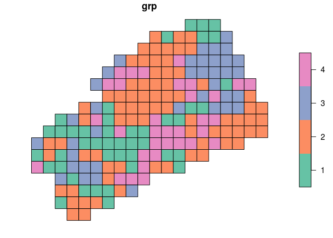

Práctica de campo
=================

> Los viajes de campo nos ayudan a ratificar que sabemos poco o nada acerca de la naturaleza

No deberían existir obstáculos para salir al campo porque, a fin de cuentas, es allí donde podemos recoger datos y donde nos surgirán nuevas preguntas. Normalmente, durante una fase de exploración, los planes son inútiles, incluso molestos. Pero cuando se trata de responder preguntas concretas, entonces hay que añadir una capa de planificación, que incluya preguntas de investigación y diseño de muestreo, preferiblemente con un enfoque de reproducibilidad (ejem, luego los administrativos te dirán que es más importante hacer 20 solicitudes de cheques, escribir 30 oficios y 10 informes, buscar 50 cotizaciones y cualquier otra vaina con tal de que no viajes; corre por tu vida en el momento que veas más papeles que datos). Este repo aspira a cumplir dicha misión de asesorarte con un mínimo de planificación en tu recogida de datos, reconociendo en todo caso que se trata de un "trabajo en desarrollo".

Enfoques
--------

Basado en las preguntas de cada estudiante, se puede asumir que hay al menos dos enfoques en los estudios sobre hormigas a realizar:

### Relación con el hábitat

### Nidos

### ¿Acaso hay un tercer enfoque relacionado con cebos?

Parecería que surje un tercero, que es el tema del efecto que pueden tener los cebos en las muestras. Sin embargo, no encontré mucha "fuerza" en las preguntas formuladas sobre este tema, y pienso que se pueden agrupar en el enfoque "relación con el hábitat".

Utiliza las siguientes listas de control en forma de tareas, para confirmar que dispones de lo necesario para iniciar la colecta de especímenes/datos.

Parcelas asignadas
------------------

Las parcelas asignadas a cada persona las obtuve ejecutando el código que verás a continuación.

Primero creé una función para asignar las parcelas, que puedes consultar en el siguiente *script*. La asignación se realiza siguiendo un muestreo estratificado-aleatorio.

``` r
source('parcelalea.R')
```

A continuación cargué el archivo de parcelas 50x50 del campus UASD, definí tipos de cobertura por persona y le pedí a la función `parcelalea` que seleccionara, aleatoriamente, un número de parcelas dentro de los tipos de coberturas asignadas a cada persona:

``` r
library(sf)
library(tidyverse)
parcelas_uasd <- st_read('c50mpctgrp_para_googlemaps.gpkg')
```

    ## Reading layer `c50mpctgrp_para_googlemaps' from data source `/home/jr/Documentos/clases_UASD/201902/biogeografia/asignaciones/unidad-0-asignacion-4-practica-campo-material-y-odk/c50mpctgrp_para_googlemaps.gpkg' using driver `GPKG'
    ## Simple feature collection with 189 features and 3 fields
    ## geometry type:  POLYGON
    ## dimension:      XY
    ## bbox:           xmin: 402650 ymin: 2041050 xmax: 403650 ymax: 2041900
    ## epsg (SRID):    32619
    ## proj4string:    +proj=utm +zone=19 +datum=WGS84 +units=m +no_defs

``` r
#Un mapa preliminar:
plot(parcelas_uasd['grp'])
```



> [Aquí](https://drive.google.com/open?id=171pW12jdkDwmzJuwjocoVjnC7ns&usp=sharing) alojé un mapa estilizado para uso en campo con el teléfono.

``` r
#Estos son los tipos de coberturas del campus
unique(parcelas_uasd$nombre)
```

    ## [1] construido, mobiliario (bordes edificios, acerado, bancos, postes...)
    ## [2] edificación erguida                                                  
    ## [3] suelo, herbáceas, no edificado ni cubierto                           
    ## [4] dosel                                                                
    ## 4 Levels: construido, mobiliario (bordes edificios, acerado, bancos, postes...) ...

``` r
estfuente <- paste0(
  'https://raw.githubusercontent.com/biogeografia-201902/',
  'miembros-y-colaboradores/master/suscripciones_github.txt'
)
estudiantes <- readLines(estfuente)
df <- data.frame(usuariogh = gsub(' .*$', '', estudiantes))
df
```

    ##           usuariogh
    ## 1         AbigailCP
    ## 2  BidelkisCastillo
    ## 3       dahianagb07
    ## 4          emdilone
    ## 5        enrique193
    ## 6         Erasbel05
    ## 7            geofis
    ## 8   hoyodepelempito
    ## 9       jimenezsosa
    ## 10    Jorge-Mutonen
    ## 11     JuanJoseGH06
    ## 12        Mangoland
    ## 13        maritzafg
    ## 14   merali-rosario
    ## 15   ramosramos1886
    ## 16        sanchez26
    ## 17     victorcabsid
    ## 18        yanderlin

``` r
df[df$usuario=='BidelkisCastillo','tipos'][[1]] <- list(c('construido', 'suelo'))
df[df$usuario=='dahianagb07','tipos'][[1]] <- list(c('construido', 'suelo'))
df[df$usuario=='emdilone','tipos'][[1]] <- list(c('dosel', 'suelo'))
df[df$usuario=='enrique193','tipos'][[1]] <- list(c('dosel', 'construido'))
df[df$usuario=='jimenezsosa','tipos'][[1]] <- list(c('dosel', 'construido'))
df[df$usuario=='Jorge-Mutonen','tipos'][[1]] <- list(c('dosel', 'construido'))
df[df$usuario=='Jorge-Mutonen','tipos'][[1]] <- list(c('dosel', 'suelo'))
df[df$usuario=='Mangoland','tipos'][[1]] <- list(c('construido', 'suelo'))
df[df$usuario=='maritzafg','tipos'][[1]] <- list(c('construido', 'suelo'))
df[df$usuario=='merali-rosario','tipos'][[1]] <- list(c('construido', 'dosel'))
df[df$usuario=='yanderlin','tipos'][[1]] <- list(c('dosel', 'suelo'))
df
```

    ##           usuariogh             tipos
    ## 1         AbigailCP              NULL
    ## 2  BidelkisCastillo construido, suelo
    ## 3       dahianagb07 construido, suelo
    ## 4          emdilone      dosel, suelo
    ## 5        enrique193 dosel, construido
    ## 6         Erasbel05              NULL
    ## 7            geofis              NULL
    ## 8   hoyodepelempito              NULL
    ## 9       jimenezsosa dosel, construido
    ## 10    Jorge-Mutonen      dosel, suelo
    ## 11     JuanJoseGH06              NULL
    ## 12        Mangoland construido, suelo
    ## 13        maritzafg construido, suelo
    ## 14   merali-rosario construido, dosel
    ## 15   ramosramos1886              NULL
    ## 16        sanchez26              NULL
    ## 17     victorcabsid              NULL
    ## 18        yanderlin      dosel, suelo

``` r
#La semilla ayuda a generar números aleatorios de forma reproducible
df$semilla <- sapply(
  df$usuario,
  function(x)
    gsub('\\D', '', substr(digest::digest(x, algo = 'md5'), 1, 10))
)
df
```

    ##           usuariogh             tipos   semilla
    ## 1         AbigailCP              NULL   5437183
    ## 2  BidelkisCastillo construido, suelo     43850
    ## 3       dahianagb07 construido, suelo     60258
    ## 4          emdilone      dosel, suelo  24920155
    ## 5        enrique193 dosel, construido       064
    ## 6         Erasbel05              NULL  61547643
    ## 7            geofis              NULL   0839355
    ## 8   hoyodepelempito              NULL       397
    ## 9       jimenezsosa dosel, construido    383025
    ## 10    Jorge-Mutonen      dosel, suelo     99867
    ## 11     JuanJoseGH06              NULL    654858
    ## 12        Mangoland construido, suelo 727149007
    ## 13        maritzafg construido, suelo  19840786
    ## 14   merali-rosario construido, dosel    963659
    ## 15   ramosramos1886              NULL    956743
    ## 16        sanchez26              NULL     80801
    ## 17     victorcabsid              NULL    703317
    ## 18        yanderlin      dosel, suelo   9444744

### BidelkisCastillo. **Relación con el hábitat**

> Utiliza las barras horizontales para ver tus parcelas

``` r
x <- "BidelkisCastillo"
parcelalea(estudiante = x, tipos = df[df$usuario == x, "tipos"][[1]], semilla = df[df$usuario == 
    x, "semilla"])
```

    ## Usuario/a BidelkisCastillo, de la cobertura tipo "construido, mobiliario (bordes edificios, acerado, bancos, postes...)", elegir al menos 6 de las siguientes parcelas: 3, 8, 53, 78, 95, 105, 106, 152, 169, 178, 187
    ## Usuario/a BidelkisCastillo, de la cobertura tipo "suelo, herbáceas, no edificado ni cubierto", elegir al menos 5 de las siguientes parcelas: 16, 27, 37, 39, 40, 122, 159, 160, 182

### dahianagb07. **Nidos**

> Utiliza las barras horizontales para ver tus parcelas

``` r
x <- 'dahianagb07'
parcelalea(
  estudiante = x,
  tipos = df[df$usuario==x,'tipos'][[1]],
  semilla = df[df$usuario==x,'semilla']
)
```

    ## Usuario/a dahianagb07, de la cobertura tipo "construido, mobiliario (bordes edificios, acerado, bancos, postes...)", elegir al menos 6 de las siguientes parcelas: 1, 53, 78, 89, 104, 110, 127, 130, 146, 147, 163
    ## Usuario/a dahianagb07, de la cobertura tipo "suelo, herbáceas, no edificado ni cubierto", elegir al menos 5 de las siguientes parcelas: 10, 25, 27, 30, 38, 42, 66, 70, 143

### emdilone. **Relación con el hábitat**

> Utiliza las barras horizontales para ver tus parcelas

``` r
x <- 'emdilone'
parcelalea(
  estudiante = x,
  tipos = df[df$usuario==x,'tipos'][[1]],
  semilla = df[df$usuario==x,'semilla']
)
```

    ## Usuario/a emdilone, de la cobertura tipo "suelo, herbáceas, no edificado ni cubierto", elegir al menos 6 de las siguientes parcelas: 10, 17, 28, 40, 42, 52, 107, 160, 168, 171, 182
    ## Usuario/a emdilone, de la cobertura tipo "dosel", elegir al menos 5 de las siguientes parcelas: 24, 32, 50, 88, 97, 98, 134, 155, 174

### enrique193. **Nidos**. Muestreo por conveniencia

> Utiliza las barras horizontales para ver tus parcelas

``` r
x <- 'enrique193'
print('Usuario/a enrique193, elegir al menos 6 de las siguientes parcelas "próximas a sitios de comida": 10, 18, 21, 22, 42, 50, 51, 79, 166, 167, 151, ')
```

    ## [1] "Usuario/a enrique193, elegir al menos 6 de las siguientes parcelas \"próximas a sitios de comida\": 10, 18, 21, 22, 42, 50, 51, 79, 166, 167, 151, "

``` r
print('Usuario/a enrique193, elegir al menos 5 de las siguientes parcelas "alejadas de sitios de comida": 68, 77, 81, 86, 109, 159, 170')
```

    ## [1] "Usuario/a enrique193, elegir al menos 5 de las siguientes parcelas \"alejadas de sitios de comida\": 68, 77, 81, 86, 109, 159, 170"

### jimenezsosa. **Relación con el hábitat**

> Utiliza las barras horizontales para ver tus parcelas

``` r
x <- 'jimenezsosa'
parcelalea(
  estudiante = x,
  tipos = df[df$usuario==x,'tipos'][[1]],
  semilla = df[df$usuario==x,'semilla']
)
```

    ## Usuario/a jimenezsosa, de la cobertura tipo "construido, mobiliario (bordes edificios, acerado, bancos, postes...)", elegir al menos 6 de las siguientes parcelas: 2, 8, 9, 53, 106, 111, 128, 130, 157, 178, 187
    ## Usuario/a jimenezsosa, de la cobertura tipo "dosel", elegir al menos 5 de las siguientes parcelas: 31, 33, 43, 88, 97, 112, 114, 164, 174

### Jorge-Mutonen. **Relación con el hábitat**

> Utiliza las barras horizontales para ver tus parcelas

``` r
x <- 'Jorge-Mutonen'
parcelalea(
  estudiante = x,
  tipos = df[df$usuario==x,'tipos'][[1]],
  semilla = df[df$usuario==x,'semilla']
)
```

    ## Usuario/a Jorge-Mutonen, de la cobertura tipo "suelo, herbáceas, no edificado ni cubierto", elegir al menos 6 de las siguientes parcelas: 26, 27, 28, 29, 41, 64, 125, 158, 170, 171, 182
    ## Usuario/a Jorge-Mutonen, de la cobertura tipo "dosel", elegir al menos 5 de las siguientes parcelas: 44, 49, 50, 54, 88, 98, 135, 174, 175

### Mangoland. **Relación con el hábitat**

> Utiliza las barras horizontales para ver tus parcelas

``` r
x <- 'Mangoland'
parcelalea(
  estudiante = x,
  tipos = df[df$usuario==x,'tipos'][[1]],
  semilla = df[df$usuario==x,'semilla']
)
```

    ## Usuario/a Mangoland, de la cobertura tipo "construido, mobiliario (bordes edificios, acerado, bancos, postes...)", elegir al menos 6 de las siguientes parcelas: 3, 8, 85, 104, 106, 128, 140, 148, 156, 178, 183
    ## Usuario/a Mangoland, de la cobertura tipo "suelo, herbáceas, no edificado ni cubierto", elegir al menos 5 de las siguientes parcelas: 16, 17, 18, 29, 40, 66, 86, 107, 122

### maritzafg. **Nidos**

> Utiliza las barras horizontales para ver tus parcelas

``` r
x <- 'maritzafg'
parcelalea(
  estudiante = x,
  tipos = df[df$usuario==x,'tipos'][[1]],
  semilla = df[df$usuario==x,'semilla']
)
```

    ## Usuario/a maritzafg, de la cobertura tipo "construido, mobiliario (bordes edificios, acerado, bancos, postes...)", elegir al menos 6 de las siguientes parcelas: 53, 78, 85, 105, 106, 128, 131, 140, 157, 178, 179
    ## Usuario/a maritzafg, de la cobertura tipo "suelo, herbáceas, no edificado ni cubierto", elegir al menos 5 de las siguientes parcelas: 25, 27, 28, 39, 66, 80, 143, 160, 168

### merali-rosario. **Relación con el hábitat**

> Utiliza las barras horizontales para ver tus parcelas

``` r
x <- 'merali-rosario'
parcelalea(
  estudiante = x,
  tipos = df[df$usuario==x,'tipos'][[1]],
  semilla = df[df$usuario==x,'semilla']
)
```

    ## Usuario/a merali-rosario, de la cobertura tipo "construido, mobiliario (bordes edificios, acerado, bancos, postes...)", elegir al menos 6 de las siguientes parcelas: 2, 9, 78, 79, 89, 104, 129, 147, 152, 157, 179
    ## Usuario/a merali-rosario, de la cobertura tipo "dosel", elegir al menos 5 de las siguientes parcelas: 24, 43, 49, 54, 133, 135, 149, 150, 164

### merali-rosario. **Relación con el hábitat**

> Utiliza las barras horizontales para ver tus parcelas

``` r
x <- 'merali-rosario'
parcelalea(
  estudiante = x,
  tipos = df[df$usuario==x,'tipos'][[1]],
  semilla = df[df$usuario==x,'semilla']
)
```

    ## Usuario/a merali-rosario, de la cobertura tipo "construido, mobiliario (bordes edificios, acerado, bancos, postes...)", elegir al menos 6 de las siguientes parcelas: 2, 9, 78, 79, 89, 104, 129, 147, 152, 157, 179
    ## Usuario/a merali-rosario, de la cobertura tipo "dosel", elegir al menos 5 de las siguientes parcelas: 24, 43, 49, 54, 133, 135, 149, 150, 164

### yanderlin. **Relación con el hábitat**

> Utiliza las barras horizontales para ver tus parcelas

``` r
x <- 'yanderlin'
parcelalea(
  estudiante = x,
  tipos = df[df$usuario==x,'tipos'][[1]],
  semilla = df[df$usuario==x,'semilla']
)
```

    ## Usuario/a yanderlin, de la cobertura tipo "suelo, herbáceas, no edificado ni cubierto", elegir al menos 6 de las siguientes parcelas: 19, 26, 28, 29, 30, 42, 64, 67, 82, 159, 160
    ## Usuario/a yanderlin, de la cobertura tipo "dosel", elegir al menos 5 de las siguientes parcelas: 43, 50, 54, 93, 98, 113, 132, 150, 174

Tarea 1. Estudia el siguiente protocolo de recogida de datos según sea tu caso.
-------------------------------------------------------------------------------

### Relación con hábitat

### Nidos

Tarea 2. Tus lugares de muestreo y tus preguntas de investigación
-----------------------------------------------------------------

Toma nota de tus lugares de muestreo asignados. Por otra parte, seguramente las tienes a mano, pero te incluyo también las URL de los repos con tus preguntas de investigación.

-   -   -   

Tarea 3. Tu formulario de campo
-------------------------------

### Formulario de campo para relación con hábitat (A)

### Formulario de campo para estudio de nidos (B)

Tarea 4. Revisa tu material de campo
------------------------------------

-   Frascos, mínimo 10, pero dependerá mucho de tus preguntas de investigación.
-   Alcohol etílico al 70-80%
-   Pincel
-   Cebo (variará según tu pregunta de investigación)
-   Dispositivo Android + ODK Collect + Formularios descargados). Alternativamente, formularios en papel

Tarea final. Ajusta tus expectativas
------------------------------------

Es probable que, aun teniendo unas preguntas de investigación debidamente formuladas y un diseño de muestreo acorde a lo que quieres responder, te encuentres al final de los análisis con lo que a veces se denomina resultados negativos. Significa que podrías no encontrar un efecto, un patrón, y lo importante es que debes interpretarlo adecuadamente. Considera lo siguiente:

-   En primer lugar, considera que tu muestra es pequeña. La idea no es que hagas un completo estudio sobre hormigas, sino que ensayes técnicas de formulación de preguntas, y de recogida y análisis de datos, pensando en aplicarlo a algo más grande en el futuro. Tu tesis será un buen terreno para poner en práctica estas técnicas.

-   En segundo lugar, con independencia de que la muestra será pequeña, un resultado negativo es también un resultado, porque responde a unas preguntas y probablemente abre otras.

-   Finalmente, reconoce la limitación temporal. En 5 meses no podrás ver ni aplicar todas las técnicas biogeográficas que existen en el "mercado". Sin embargo, dispondrás de fuentes bibliográficas, nuevos recursos y nuevas herramientas para localizar soluciones a tus futuros problemas en ecología.
